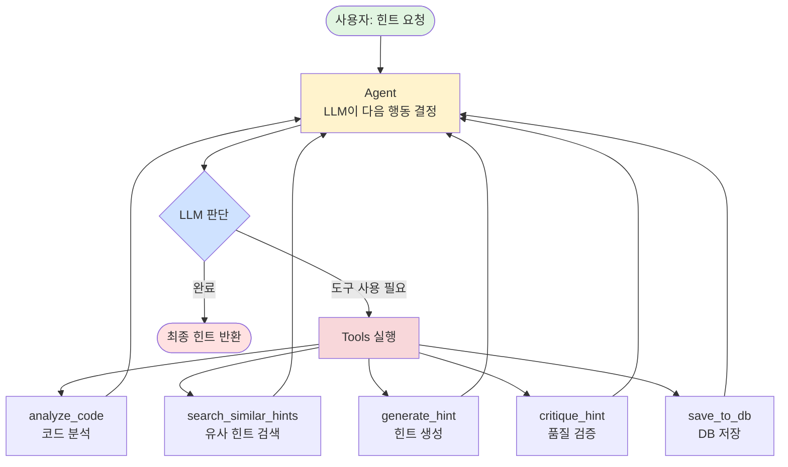

# 진짜 LangGraph 힌트 Agent 설계

> **핵심**: LLM이 스스로 판단하고, Tool을 사용하며, 자기 개선하는 Agent

---

## 🎯 LangGraph의 핵심 개념

### Agent란?

**Agent = LLM + Tools + Memory + Reasoning**

```
일반 LLM: "질문 → 답변" (단순)
Agent: "질문 → 생각 → 도구 사용 → 관찰 → 재사고 → 도구 사용 → ... → 답변" (복잡)
```

---

## 📊 전체 그래프 구조

### Mermaid 다이어그램



---

## 🔄 ReAct 패턴 상세 흐름

```
┌─────────────────────────────────────────────────────────────┐
│                    힌트 Agent 실행 흐름                      │
└─────────────────────────────────────────────────────────────┘

사용자 입력: "문제 1000번 힌트 줘, 코드: print(a+b)"
    │
    ▼
┌────────────────────────────────────────────────────────┐
│  STEP 1: Agent (LLM 사고)                              │
│                                                        │
│  LLM 생각:                                             │
│  "사용자가 힌트를 요청했네. 먼저 코드를 분석해야겠다"    │
│                                                        │
│  결정: analyze_code 도구 사용                          │
└────────────┬───────────────────────────────────────────┘
             │
             ▼
┌────────────────────────────────────────────────────────┐
│  TOOL: analyze_code(user_code="print(a+b)")           │
│                                                        │
│  실행:                                                 │
│  - 문법 오류: 0개                                      │
│  - 패턴 일치도: 30%                                    │
│  - 복잡도: 1                                           │
│  - 품질 점수: 40/100                                   │
│                                                        │
│  관찰: "입력 처리 부분이 없고, 변수 정의 안 됨"        │
└────────────┬───────────────────────────────────────────┘
             │
             ▼
┌────────────────────────────────────────────────────────┐
│  STEP 2: Agent (LLM 재사고)                            │
│                                                        │
│  LLM 생각:                                             │
│  "코드 분석 결과를 봤어. 패턴 일치도가 30%로 낮네.     │
│   입력 처리가 빠졌구나. 유사한 문제의 힌트를           │
│   검색해서 참고해볼까?"                                 │
│                                                        │
│  결정: search_similar_hints 도구 사용                  │
└────────────┬───────────────────────────────────────────┘
             │
             ▼
┌────────────────────────────────────────────────────────┐
│  TOOL: search_similar_hints(problem_id="1000")        │
│                                                        │
│  실행:                                                 │
│  - 벡터 DB 검색 (ChromaDB)                            │
│  - 유사 문제 힌트 3개 발견                             │
│                                                        │
│  관찰: "다른 학생들도 입력 처리를 빠뜨렸고,            │
│         input().split() 힌트가 효과적이었음"          │
└────────────┬───────────────────────────────────────────┘
             │
             ▼
┌────────────────────────────────────────────────────────┐
│  STEP 3: Agent (LLM 재사고)                            │
│                                                        │
│  LLM 생각:                                             │
│  "좋아, 이제 힌트를 생성할 수 있겠어.                  │
│   분석 결과와 유사 힌트를 바탕으로 생성하자"           │
│                                                        │
│  결정: generate_hint 도구 사용                         │
└────────────┬───────────────────────────────────────────┘
             │
             ▼
┌────────────────────────────────────────────────────────┐
│  TOOL: generate_hint(context={...})                   │
│                                                        │
│  실행:                                                 │
│  - LLM으로 힌트 생성                                   │
│  - 컨텍스트: 코드 분석 + 유사 힌트                     │
│                                                        │
│  생성된 힌트:                                          │
│  "입력을 받는 부분이 빠졌습니다.                        │
│   input().split()을 사용해보세요..."                   │
└────────────┬───────────────────────────────────────────┘
             │
             ▼
┌────────────────────────────────────────────────────────┐
│  STEP 4: Agent (LLM 재사고)                            │
│                                                        │
│  LLM 생각:                                             │
│  "힌트를 생성했어. 근데 품질이 괜찮을까?               │
│   품질 검증을 한번 해보자"                              │
│                                                        │
│  결정: critique_hint 도구 사용                         │
└────────────┬───────────────────────────────────────────┘
             │
             ▼
┌────────────────────────────────────────────────────────┐
│  TOOL: critique_hint(hint="...")                      │
│                                                        │
│  실행:                                                 │
│  - 다른 LLM으로 품질 평가                              │
│  - 기준: 교육적 가치, 정답 누설 여부 등               │
│                                                        │
│  평가 결과:                                            │
│  - 점수: 2.5/5 (미흡)                                  │
│  - 문제: "함수명을 직접 알려줘서 너무 쉬움"           │
└────────────┬───────────────────────────────────────────┘
             │
             ▼
┌────────────────────────────────────────────────────────┐
│  STEP 5: Agent (LLM 재사고)                            │
│                                                        │
│  LLM 생각:                                             │
│  "앗, 품질이 미흡하네. 함수명을 빼고 다시 만들자"      │
│                                                        │
│  결정: generate_hint 도구 재사용 (더 소크라테스식)     │
└────────────┬───────────────────────────────────────────┘
             │
             ▼
┌────────────────────────────────────────────────────────┐
│  TOOL: generate_hint(context={...}, style="socratic") │
│                                                        │
│  생성된 힌트 (개선):                                   │
│  "입력을 어떻게 받아야 할까요?                         │
│   두 수를 공백으로 구분하여 받으려면?"                  │
└────────────┬───────────────────────────────────────────┘
             │
             ▼
┌────────────────────────────────────────────────────────┐
│  STEP 6: Agent (LLM 재사고)                            │
│                                                        │
│  LLM 생각:                                             │
│  "다시 품질 검증해보자"                                 │
│                                                        │
│  결정: critique_hint 도구 사용                         │
└────────────┬───────────────────────────────────────────┘
             │
             ▼
┌────────────────────────────────────────────────────────┐
│  TOOL: critique_hint(hint="...")                      │
│                                                        │
│  평가 결과:                                            │
│  - 점수: 4.5/5 (우수)                                  │
│  - 통과!                                               │
└────────────┬───────────────────────────────────────────┘
             │
             ▼
┌────────────────────────────────────────────────────────┐
│  STEP 7: Agent (LLM 최종 판단)                         │
│                                                        │
│  LLM 생각:                                             │
│  "좋아, 품질이 통과했어. 이제 DB에 저장하고 끝내자"    │
│                                                        │
│  결정: save_to_db 도구 사용                            │
└────────────┬───────────────────────────────────────────┘
             │
             ▼
┌────────────────────────────────────────────────────────┐
│  TOOL: save_to_db(hint="...", metrics={...})          │
│                                                        │
│  실행:                                                 │
│  - HintRequest 저장                                    │
│  - HintMetrics 저장                                    │
│  - 배지 획득 체크                                      │
└────────────┬───────────────────────────────────────────┘
             │
             ▼
┌────────────────────────────────────────────────────────┐
│  STEP 8: Agent (LLM 종료 판단)                         │
│                                                        │
│  LLM 생각:                                             │
│  "모든 작업이 끝났어. 사용자에게 최종 힌트를 반환"     │
│                                                        │
│  결정: 완료                                            │
└────────────┬───────────────────────────────────────────┘
             │
             ▼
        사용자에게 반환:
        "입력을 어떻게 받아야 할까요?
         두 수를 공백으로 구분하여 받으려면?"
```

---

## 🛠️ Tool 정의 (5개)

```
┌────────────────────────────────────────────────────────┐
│  Tool 1: analyze_code                                  │
├────────────────────────────────────────────────────────┤
│  입력: user_code (str), problem_id (str)               │
│  기능: 코드 정적 분석 (6가지 메트릭)                   │
│  출력: {syntax_errors, test_pass_rate, ...}            │
│  구현: code_analyzer.py 호출                           │
└────────────────────────────────────────────────────────┘

┌────────────────────────────────────────────────────────┐
│  Tool 2: search_similar_hints                          │
├────────────────────────────────────────────────────────┤
│  입력: problem_id (str), user_code (str)               │
│  기능: 벡터 DB에서 유사한 과거 힌트 검색               │
│  출력: [{"hint": "...", "similarity": 0.85}, ...]      │
│  구현: ChromaDB 쿼리                                   │
└────────────────────────────────────────────────────────┘

┌────────────────────────────────────────────────────────┐
│  Tool 3: generate_hint                                 │
├────────────────────────────────────────────────────────┤
│  입력: context (dict), style (str)                     │
│  기능: LLM으로 힌트 생성                               │
│  출력: hint (str)                                      │
│  구현: Hugging Face API 호출                           │
└────────────────────────────────────────────────────────┘

┌────────────────────────────────────────────────────────┐
│  Tool 4: critique_hint                                 │
├────────────────────────────────────────────────────────┤
│  입력: hint (str), context (dict)                      │
│  기능: 힌트 품질 검증 (Self-Critique)                  │
│  출력: {score: 4.5, pass: true, feedback: "..."}       │
│  구현: 다른 LLM으로 평가                               │
└────────────────────────────────────────────────────────┘

┌────────────────────────────────────────────────────────┐
│  Tool 5: save_to_db                                    │
├────────────────────────────────────────────────────────┤
│  입력: hint (str), metrics (dict), user_id (int)       │
│  기능: DB 저장 및 배지 체크                            │
│  출력: {"saved": true, "new_badges": [...]}            │
│  구현: Django ORM                                      │
└────────────────────────────────────────────────────────┘
```

---

## 🧠 Agent State (상태 관리)

```python
class AgentState(TypedDict):
    """Agent가 유지하는 상태"""

    # 메시지 히스토리 (대화 흐름)
    messages: Annotated[list, add_messages]

    # 입력 정보
    user_id: int
    problem_id: str
    user_code: str
    hint_config: dict

    # Tool 실행 결과 (누적)
    analysis_result: Optional[dict]
    similar_hints: Optional[list]
    generated_hints: list  # 여러 번 생성 가능
    critique_results: list  # 각 힌트의 평가

    # 최종 결과
    final_hint: Optional[str]
    db_saved: bool
```

---

## 🔁 그래프 구조 (실제 코드)

```python
from langgraph.graph import StateGraph, END
from langgraph.prebuilt import ToolNode
from langchain_core.messages import HumanMessage, AIMessage

# === 1. State 정의 ===
class AgentState(TypedDict):
    messages: Annotated[list, add_messages]
    user_id: int
    problem_id: str
    user_code: str
    # ... 위 참고

# === 2. Tools 정의 ===
from langchain_core.tools import tool

@tool
def analyze_code(user_code: str, problem_id: str) -> dict:
    """사용자 코드를 분석합니다"""
    from .code_analyzer import analyze_code
    return analyze_code(user_code, problem_id)

@tool
def search_similar_hints(problem_id: str, user_code: str) -> list:
    """유사한 과거 힌트를 검색합니다"""
    # ChromaDB 쿼리
    return [...]

@tool
def generate_hint(context: dict, style: str = "balanced") -> str:
    """힌트를 생성합니다"""
    # LLM 호출
    return "..."

@tool
def critique_hint(hint: str, context: dict) -> dict:
    """힌트 품질을 검증합니다"""
    # 다른 LLM으로 평가
    return {"score": 4.5, "pass": True}

@tool
def save_to_db(hint: str, metrics: dict, user_id: int) -> dict:
    """DB에 저장합니다"""
    # Django ORM
    return {"saved": True}

tools = [analyze_code, search_similar_hints, generate_hint,
         critique_hint, save_to_db]

# === 3. LLM with Tools ===
from langchain_openai import ChatOpenAI  # 또는 HuggingFace

llm = ChatOpenAI(model="gpt-4")  # 예시
llm_with_tools = llm.bind_tools(tools)

# === 4. Agent 노드 (핵심!) ===
def agent_node(state: AgentState):
    """
    LLM이 다음 행동을 결정하는 노드

    LLM이 생각하고 도구를 선택함
    """
    messages = state["messages"]

    # LLM 호출 (도구 사용 가능)
    response = llm_with_tools.invoke(messages)

    # 응답을 state에 추가
    return {"messages": [response]}

# === 5. 조건부 라우팅 ===
def should_continue(state: AgentState) -> str:
    """
    다음 노드 결정:
    - LLM이 도구 호출했으면 → "tools"
    - 작업 완료했으면 → END
    """
    last_message = state["messages"][-1]

    # LLM이 도구를 호출했는가?
    if hasattr(last_message, 'tool_calls') and last_message.tool_calls:
        return "tools"

    # 완료
    return END

# === 6. 그래프 구성 ===
workflow = StateGraph(AgentState)

# 노드 추가
workflow.add_node("agent", agent_node)          # LLM 사고
workflow.add_node("tools", ToolNode(tools))     # 도구 실행

# 시작점
workflow.set_entry_point("agent")

# 조건부 엣지: agent → tools or END
workflow.add_conditional_edges(
    "agent",
    should_continue,
    {
        "tools": "tools",
        END: END
    }
)

# 도구 실행 후 다시 agent로 (순환!)
workflow.add_edge("tools", "agent")

# 컴파일
app = workflow.compile()
```

---

## 🎬 실행 시나리오 (ASCII)

```
사용자 → [힌트 요청]
           ↓
    ┌──────────────┐
    │   agent      │  "먼저 코드를 분석해야겠다"
    │  (LLM 생각)  │
    └──────┬───────┘
           │ tool_calls: [analyze_code]
           ▼
    ┌──────────────┐
    │   tools      │  analyze_code 실행
    │  (도구 실행)  │  → {syntax_errors: 0, ...}
    └──────┬───────┘
           │ 결과 반환
           ▼
    ┌──────────────┐
    │   agent      │  "분석 결과를 봤어. 유사 힌트 검색할까?"
    │  (LLM 재사고) │
    └──────┬───────┘
           │ tool_calls: [search_similar_hints]
           ▼
    ┌──────────────┐
    │   tools      │  search_similar_hints 실행
    │  (도구 실행)  │  → [{hint: "...", similarity: 0.85}]
    └──────┬───────┘
           │
           ▼
    ┌──────────────┐
    │   agent      │  "좋아, 힌트 생성하자"
    │  (LLM 재사고) │
    └──────┬───────┘
           │ tool_calls: [generate_hint]
           ▼
    ┌──────────────┐
    │   tools      │  generate_hint 실행
    │  (도구 실행)  │  → "입력을 받으려면..."
    └──────┬───────┘
           │
           ▼
    ┌──────────────┐
    │   agent      │  "품질 검증해보자"
    │  (LLM 재사고) │
    └──────┬───────┘
           │ tool_calls: [critique_hint]
           ▼
    ┌──────────────┐
    │   tools      │  critique_hint 실행
    │  (도구 실행)  │  → {score: 2.5, pass: false}
    └──────┬───────┘
           │
           ▼
    ┌──────────────┐
    │   agent      │  "점수가 낮네. 다시 만들자"
    │  (LLM 재사고) │
    └──────┬───────┘
           │ tool_calls: [generate_hint, style="socratic"]
           ▼
    ┌──────────────┐
    │   tools      │  generate_hint 재실행
    │  (도구 실행)  │  → "입력을 어떻게 받아야 할까요?"
    └──────┬───────┘
           │
           ▼
    ┌──────────────┐
    │   agent      │  "다시 검증"
    │  (LLM 재사고) │
    └──────┬───────┘
           │ tool_calls: [critique_hint]
           ▼
    ┌──────────────┐
    │   tools      │  critique_hint 재실행
    │  (도구 실행)  │  → {score: 4.5, pass: true}
    └──────┬───────┘
           │
           ▼
    ┌──────────────┐
    │   agent      │  "통과! DB 저장하고 끝"
    │  (LLM 재사고) │
    └──────┬───────┘
           │ tool_calls: [save_to_db]
           ▼
    ┌──────────────┐
    │   tools      │  save_to_db 실행
    │  (도구 실행)  │  → {saved: true}
    └──────┬───────┘
           │
           ▼
    ┌──────────────┐
    │   agent      │  "완료!"
    │  (LLM 종료)  │  tool_calls: None
    └──────┬───────┘
           │
           ▼
         [END]
    최종 힌트 반환
```

---

## 🔥 진짜 LangGraph의 강점

### 1. **자율성**
- LLM이 스스로 순서 결정
- 개발자가 모든 경우의 수 코딩 불필요

### 2. **순환 구조**
- 품질 미달 → 재생성 → 재검증 (무한 루프 가능)
- 일반 파이프라인은 불가능

### 3. **Tool 추상화**
- 함수를 `@tool`로 감싸면 LLM이 자동으로 사용법 파악
- 문서화 자동

### 4. **상태 유지**
- 모든 시도를 messages에 누적
- 이전 시도를 기억하고 개선

### 5. **Human-in-the-Loop** (선택)
- 중간에 사람이 개입 가능
- "이 힌트 괜찮아?" 물어보고 승인받기

---

## 📈 메시지 흐름 예시

```python
# 실행 시작
state = {
    "messages": [
        HumanMessage(content="문제 1000번 힌트 줘, 코드: print(a+b)")
    ],
    "user_id": 1,
    "problem_id": "1000",
    "user_code": "print(a+b)"
}

# === 1회차: Agent ===
state["messages"].append(
    AIMessage(
        content="코드를 먼저 분석하겠습니다.",
        tool_calls=[{"name": "analyze_code", "args": {...}}]
    )
)

# === 1회차: Tools ===
state["messages"].append(
    ToolMessage(
        content='{"syntax_errors": 0, "pattern_match": 30%}',
        tool_call_id="call_123"
    )
)

# === 2회차: Agent ===
state["messages"].append(
    AIMessage(
        content="분석 완료. 패턴 일치도가 낮네요. 유사 힌트를 검색하겠습니다.",
        tool_calls=[{"name": "search_similar_hints", "args": {...}}]
    )
)

# ... 계속 누적 ...

# 최종
state["messages"][-1] == AIMessage(
    content="힌트: 입력을 어떻게 받아야 할까요?"  # tool_calls 없음 → 종료
)
```

---

## 🎨 시각화 (간단 버전)

```
         ┌─────────────────────────────────────┐
         │       LangGraph Hint Agent          │
         └─────────────────────────────────────┘
                         │
            ┌────────────┼────────────┐
            ▼            ▼            ▼
        ┌───────┐   ┌───────┐   ┌────────┐
        │Agent  │→→→│Tools  │→→→│ END    │
        │(LLM)  │←←←│(실행) │   │(종료)  │
        └───────┘   └───────┘   └────────┘
            ↑            │
            └────────────┘
           (도구 실행 후 재사고)

Agent가 하는 일:
- "다음 뭐 할까?" 생각
- 도구 선택 및 호출
- 결과 관찰 후 재판단

Tools가 하는 일:
- Agent가 선택한 도구 실행
- 결과 반환
- Agent에게 돌아감
```

---

## 💡 요약

| 기존 (파이프라인) | LangGraph (Agent) |
|------------------|-------------------|
| 고정된 순서 | **LLM이 순서 결정** |
| 단방향 | **순환 가능** |
| 조건문으로 분기 | **LLM이 판단** |
| 한 번 실행 | **자기 개선 루프** |
| 도구 직접 호출 | **LLM이 도구 선택** |

---

이게 **진짜 LangGraph**입니다!
